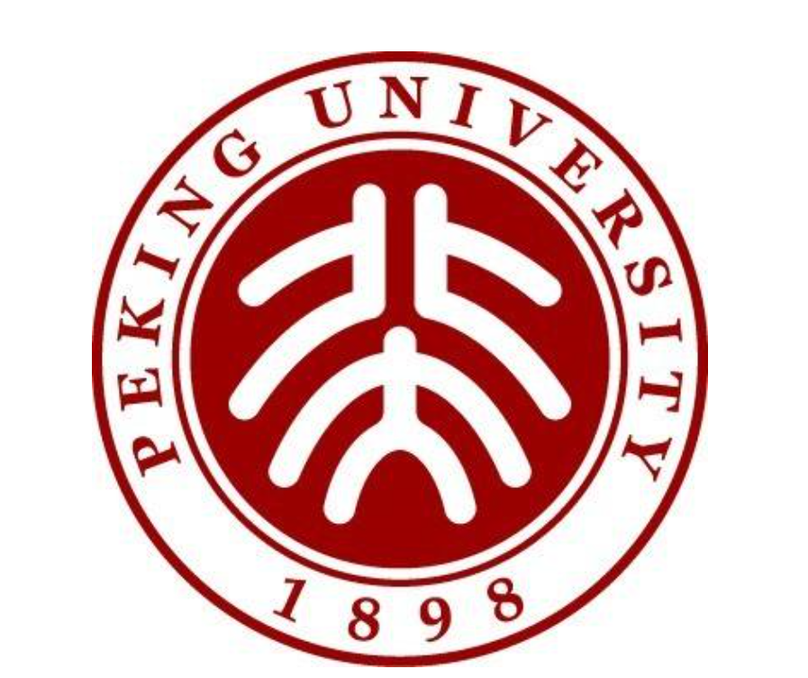

<html lang="zh-cn">
  <head>
    <meta charset="utf-8"/>
    <link href="test.css" rel="stylesheet" type="text/css"/>
  </head>
<body>
  
  
    <h1>welcome to my website</h1>
    
你们好，今天我来介绍一下北京大学

    
这是我们的校徽：

    
    
诶，不小心放错图了,这才是：

    
    
很好看对吧！

    
这是我们北大的学生：

    
    
又放错图了......这才是：

    
    
  

    
欢迎来到<a href="https://www.pku.edu.cn/">PKU</a>

    
下面是PKU的一些好朋友：

  <ul>
    <li><a href="https://www.tsinghua.edu.cn/">清华大学</a></li>
    <li><a href="https://www.buaa.edu.cn/">北京航空航天大学</a></li>
    <li><a href="http://www.bit.edu.cn/">北京理工大学</a></li>
  </ul>
  
看完图片，是不是有一种想来到pku的冲动呢？但pku可不是说来就来的，不过别着急，下表罗列了来到我们pku的方法：

  <table>
    <tr>
      <td>努力学习</td>
      <td>study hard</td>
      <td>Streng studieren</td>
      <td>勉強に励む</td>
    </tr>
    <tr>
      <td>усердно учиться  </td>
      <td>Travailler dur</td>
      <td>열심히 공부 하 다</td>
      <td>Estudar Muito</td>
    </tr>
  </table>
  
怎么样？看完这些方法感觉进pku还是很轻松的吧，不用谢我~

  

